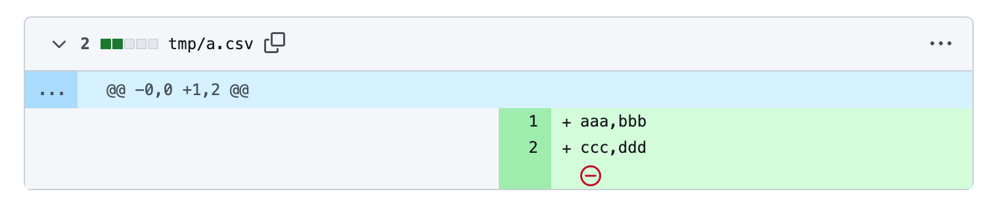
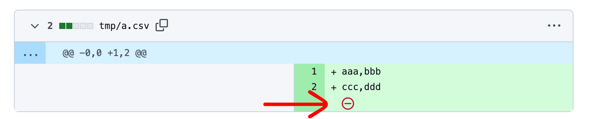
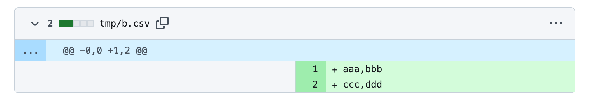
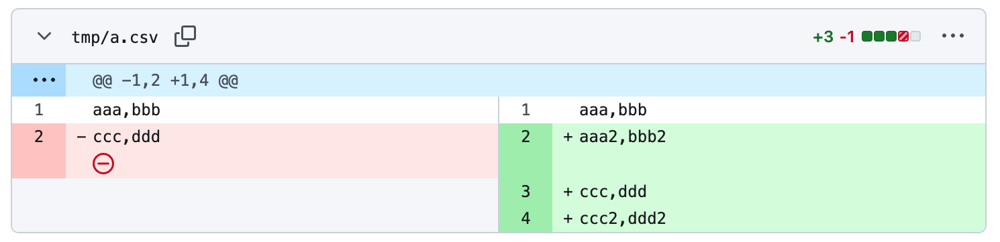
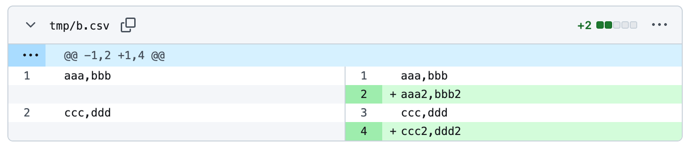
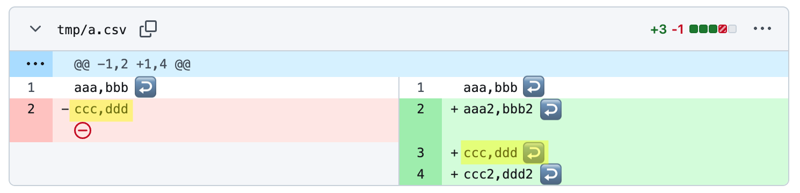
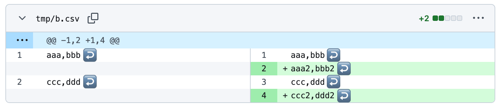
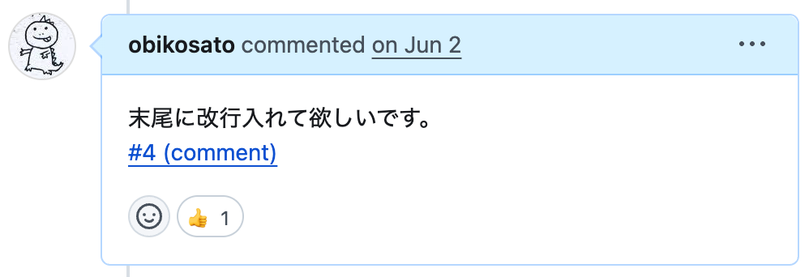

<!-- _class: title -->
<!-- _paginate: false -->
<!-- _footer: "" -->

# ファイルの末尾には改行を入れましょう

2025-07-29
[@obikosato](https://github.com/obikosato)


---

## これ



GitHub上のプルリクとかで見かけるやつ

---

## これ



GitHub上のプルリクとかで見かけるやつ

---

⚠️ 末尾に改行がない↓


✅ 末尾に改行がある↓



---

## 末尾に改行がないと何が問題？

POSIXでは「行＝改行で終わる」と定義されています。

### POSIX標準の定義より

- **行**: 「改行で終わる」
- **テキストファイル**: 「行の集合」

<br>

UNIX系ツールの多くがこれに基づいており、**「行は改行で終わる」ことを前提に動作**します。
末尾に改行がないと、意図しない挙動を引き起こすことがあります。

---

### 例：`wc -l` で行数が正しくカウントされない

```sh
$ cat a.csv
aaa,bbb
ccc,ddd%
```

```sh
$ wc -l a.csv
       1
```

本来は2行のはずが、1行としてカウントされる。

---

### 例：`cat` でファイルがちゃんと結合されない

```sh
$ cat a.csv
aaa,bbb
ccc,ddd%
```

```sh
$ cat a.csv a.csv
aaa,bbb
ccc,dddaaa,bbb
ccc,ddd%
```

末尾に改行がないため、2つ目のファイルの内容が1行目にくっついてしまう。

---

## Gitでも差分がおかしくなってしまう😭

---

⚠️ 末尾に改行がない↓



✅ 末尾に改行がある↓



---

⚠️ 末尾に改行がない↓



✅ 末尾に改行がある↓



---

## 末尾改行警察オビコフ



---

## 末尾に改行が入らない原因

### エディタ、AI

**Vim**はデフォルトで自動で末尾に改行を入れてくれるけど、
**VSCode**はデフォルトでは末尾に改行を入れてくれない。

Claude CodeなどのAIツールも指示しないと末尾に改行を入れてくれないことがある。

---

## 自動的にファイルの末尾に改行が入るようにしましょう🙏

---

### VSCodeのsettings.json

```jsonc
{
  "files.insertFinalNewline": true, // ファイルの末尾に改行を入れる
  "files.trimFinalNewlines": true // ファイルの末尾の改行が複数あったら1つにまとめる
}
```

### .editorconfig

```ini
[*]
insert_final_newline = true # ファイルの末尾に改行を入れる
```

### AI

AI（Claude Codeなど）は末尾改行が苦手なようなので、明示的に指示しましょう。
お手元のAIにもよろしくお伝えください。

---

## プロジェクト内で強制する

- コミット時にチェックする
  - husky（<https://typicode.github.io/husky/>）や、pre-commit（<https://pre-commit.com/>）
- CIの一環としてチェックする（確実）
  - GitHub Actionsなど

---

## GitHub Actionsでeditorconfig-checkerを使う

.editorconfigのルールに合っていない場合は失敗（エラー）として検知されます。

```yaml
name: EditorConfig Checker

on:
  pull_request:
    branches:
      - main

jobs:
  editorconfig:
    runs-on: ubuntu-20.04
    steps:
      - uses: actions/checkout@v4
      - uses: editorconfig-checker/action-editorconfig-checker@main
      - run: editorconfig-checker
```

- <https://github.com/marketplace/actions/editorconfig-checker-action>

---

## まとめ

- ファイルの末尾に改行を入れましょう🙏
- 自動的（強制的）に改行が入るように設定しましょう🤝
- みんなで習慣化しましょう👮

---

## 参考

- なぜファイルの末尾に改行を入れたほうが良いのか #Git - Qiita（本発表の元ネタ）
  - <https://qiita.com/hamacccccchan/items/11c17c7412a5aeb2ad74>

---

<!-- _class: title -->
<!-- _paginate: false -->
<!-- _footer: "" -->

## 付録・補足用スライド

---

## （おまけ）リポジトリ内の末尾改行のないファイル検出してみよう👮‍♂️

適当なリポジトリのルートで実行してみましょう。（UNIX互換シェル環境で）

```sh
git ls-files -z | while IFS= read -r -d '' file; do
  file --mime "${file}" | grep -q -e "charset=binary" -e "image/svg+xml" || 
  tail -c1 "${file}" | read -r _ || 
  echo "Missing newline: ${file}"
done
```

---

## POSIX標準

- <https://pubs.opengroup.org/onlinepubs/9799919799/>

> ### 3.387 Text File
>
> A file that contains characters organized into zero or more lines. The lines do not contain NUL characters and none can exceed {LINE_MAX} bytes in length, including the \<newline> character. ...
>
> ### 3.185 Line
>
> A sequence of zero or more non-\<newline> characters plus a terminating \<newline> character.

テキストファイルは行か行の集合であり、行はnewlineで終わる。

---

## 改行コード問題

今回は触れなかったですが、改行コード（LF/CRLF）も問題になることがあります。
GitはLFを推奨していますが、WindowsではCRLFがデフォルトです。
Gitの設定や、.editorconfigでLFに統一する設定があります。

- 行終端を処理するようGitを設定する - GitHub Docs
  - <https://docs.github.com/ja/get-started/git-basics/configuring-git-to-handle-line-endings>
- Gitリポジトリから意図しない改行コードを出来る限り排除する - Activ8 Tech Blog
  - <https://synamon.hatenablog.com/entry/2023/05/26/120341>

---

## git diff

`git diff`では⛔️の代わりに、「`\ No newline at end of file`」が出ます。

```diff
 aaa,bbb
-ccc,ddd
\ No newline at end of file
+aaa2,bbb2
+ccc,ddd
+ccc2,ddd2
```

---

## 「プログラムが動くなら末尾改行なんていらなくない？」への回答

考えてみてください。**FormatterやLinterはなぜ入れるんでしょう？**

- コードの読みやすさ
- 差分を減らすための整形
- チームでの一貫性
- 機械でチェックできることを自動化する

LinterやFormatterが怒るのは **「動かないから」じゃなくて「壊れやすくなるから」** です。

安全なコードを書くためのルールを守ることは、開発者としての責任です。
